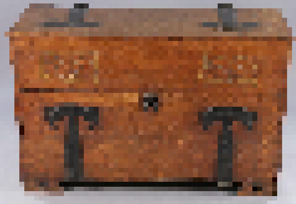

A modern MU* engine with [AberMUD](http://ftp.linux.org.uk/pub/linux/alan/Software/Games/AberMUD5/SOURCE/) universe.

Based on dumserver by Bartek Radwanski and Mark Frimston https://github.com/wowpin/dumserver

You can also use a mud client of your choice if you wish - use connection details below:

```
telnet [hostname] 35123
```

## Running the Server
```diff
- IMPORTANT - Python >= 3.6.7 is required (Ubuntu >= 18.04 LTS)!
```
1. Update your system `sudo apt update && sudo apt upgrade`
2. Get the repo `git clone https://code.freedombone.net/bashrc/AberMUSH`
3. CD into 'AberMUSH' and install the server `sudo ./installer.sh`
4. Run it by typing `python3 abermush.py`

You now should be able to connect to your server on `<server IP/hostname>:35123`


## Player Commands

All players can use the following commands:

``` bash
bio [description]                       - Set a description of yourself
change password [newpassword]           - Change your password
who                                     - List players and where they are
quit/exit                               - Leave the game
eat/drink [item]                        - Eat or drink a consumable
speak [language]                        - Switch to speaking a different language
say [message]                           - Says something out loud
look/examine                            - Examines the surroundings
go [exit]                               - Moves through the exit specified
attack [target]                         - Attack another player or NPC
check inventory                         - Check the contents of your inventory
take/get [item]                         - Pick up an item
put [item] in/on [item]                 - Put an item into or onto another one
drop [item]                             - Drop an item
whisper [target] [message]              - Whisper to a player in the same room
tell/ask [target] [message]             - Send a tell message to another player or NPC
use/hold/pick/wield [item] [left|right] - Transfer an item to your hands
stow                                    - Free your hands of items
wear [item]                             - Wear an item
remove/unwear [item]                    - Remove a worn item
open [item]                             - Open an item or door
close [item]                            - Close an item or door
affinity [player name]                  - Shows your affinity level with another player
```

## Spell Commands

Some characters can use magic with the following commands:

``` bash
prepare spells                          - List spells which can be prepared
prepare [spell name]                    - Prepares a spell
spells                                  - Lists your prepared spells
clear spells                            - Clears your prepared spells list
cast find familiar                      - Summons a familiar with random form
dismiss familiar                        - Dismisses a familiar
cast [spell name] on [target]           - Cast a spell on a player or NPC
```

Spells are defined within `spells.json` and the system for spellcasting is a simplified version of the one within conventional D&D games. You prepare a spell, it gets added to your list and then you can cast it and it disappears from the prepared list. Some spells require certain items to be in the player's inventory.


## Witch Commands

Witches are the admins of the system, and have additional supernatural powers. The first user to create an account gains witch status. Additional witches may be assigned by appending them to the `witches` file, which is located in the same directory as `abermush.py` is run from.

``` bash
close registrations                - Closes registrations of new players
open registrations                 - Allows registrations of new players
mute/silence [target]              - Mutes a player and prevents them from attacking
unmute/unsilence [target]          - Unmutes a player
freeze [target]                    - Prevents a player from moving or attacking
unfreeze [target]                  - Allows a player to move or attack
teleport [room]                    - Teleport to a room
summon [target]                    - Summons a player to your location
kick/remove [target]               - Remove a player from the game
blocklist                          - Show the current blocklist
block [word or phrase]             - Adds a word or phrase to the blocklist
unblock [word or phrase]           - Removes a word or phrase to the blocklist
describe "room" "room name"        - Changes the name of the current room
describe "room description"        - Changes the current room description
describe "tide" "room description" - Changes the room description when tide is out
describe "item" "item description" - Changes the description of an item in the room
describe "NPC" "NPC description"   - Changes the description of an NPC in the room
conjure room [direction]           - Creates a new room in the given direction
conjure npc [target]               - Creates a named NPC in the room
conjure [item]                     - Creates a new item in the room
destroy room [direction]           - Removes the room in the given direction
destroy npc [target]               - Removes a named NPC from the room
destroy [item]                     - Removes an item from the room
resetuniverse                      - Resets the universe, losing any changes from defaults
shutdown                           - Shuts down the game server
```

### NPC Types

NPCs defined within `def/npcs.json` have a few different modes. The rooms which they can occupy are defined within the `path` list and the ways in which they move is defined by the `moveType` parameter. Movement types are:

 * *cyclic* - Move from the start to the end of the list of rooms
 * *inverse cyclic* - Move from the end to the start of the list of rooms
 * *random* - Move to random rooms in the list
 * *patrol* - Move from the start to the end of the list, then back again
 * *follow* - Look for players and follow them around

If no `moveType` is specified then random movement is the default.

The speed at which NPCs move between rooms is defined by `moveDelay` and `randomFactor` parameters. RandomFactor just makes the delay between movements not completely predictable.


### NPC Conversations

You can create simple kinds of conversations with NPCs by editing `npcs.json` and adding line entries within the `conv` parameter. For example:

``` bash
"conv" : [
    [["serve","beer","?"], "Yes, of course"],
    [["serve","wine","?"], "We only serve the more disreputable wine"],
    [["have","order","like","beer","ale","drink","please"],"Here you go","give","114"],
    [["have","order","buy","purchase","trade","like","weapon","dagger","knife","please"],"This weapon may come in handy on your adventures","buy","624","1367"]
],
```

You can then tell the NPC something like:

``` bash
ask inn-keeper Do you serve wine?
```

The system will then try to match words within your `ask` command and pick the most appropriate reply:

``` bash
the old inn-keeper says: We only serve the more disreputable wine.
```

The NPC can also give an item if some words are matched, or exchange/buy/barter an item such as a gold coin for a small dagger. The numbers refer to item numbers within `items.json`.

Possible types of actions within NPC conversations are:

``` bash
give [item ID]                       - Gives an item
teach [skill] [adjustment value]     - Adjusts a skill level
transport [room ID]                  - Moves the player to a different room
taxi [room ID] [itemID]              - Moves the player to a different room in exchange for an inventory item
date [dd/mm]                         - Conversation can only occur on a given day of the year
buy [obtain item ID] [give item ID]  - Obtains one item in exchange for another
experience [points]                  - Increase player experience
```

### Spoken Languages

Players and NPCs have their own languages: `common`, `dwarvish`, `elvish`, `draconic` and `druidic`. Goblins and humans may not be able to understand each other.

The language spoken and understood by NPCs can be defined with two parameters within `npcs.json`. `language` is a list of languages which the NPC understands and `speakLanguage` is the language which they are currently using to communicate.

``` bash
"speakLanguage": "common",
"language": ["common","dwarvish"],
```

Players also have the same parameters and if they are multi-lingual then they can switch between languages using the `speak` command. For example:

``` bash
speak common
speak dwarvish
```

### Stateful NPC Conversations

It may be useful for an NPC to keep track of the state of your conversation and it's possible to do this via state variables. There is only one conversation state variable per NPC/player combination and it can be named anything you like. For example:

``` bash
"conv" : [
    [["order","beer","please"],"Free as in beer","state:beer given","give","114"],
    [["state:beer given","order","beer","please"],"Have another one then","give","114"]
],
```

Here whenever you ask for a beer the state variable `beer given` will be set for the NPC. If you subsequently ask for another beer the NPC gives a different response by matching the state variable. In this way you can have branching narratives dependent upon conversational context. Maybe an NPC only gives you some item after an appropriate sequence of dialogue.

### NPC Conversation conditions

It's also possible to add extra conditions to the conversation response selection.

``` bash
"conv" : [
    [["order","ale","please"],"Have an ale!","state:beer given","give","114"],
    [["strength>90","order","ale","please"],"I'm sorry, we don't serve bodybuilders here."]
],
```
The variables available are the various player attributes: `level`, `experience`, `strength`, `size`, `weight` (of inventory carried), `perception`, `endurance`, `charisma`, `intelligence`, `agility` and `luck`. You can match multiple conditions if necessary.

### Conditional Room Descriptions

You may want the description of a room to change if some condition is met. For example, within `rooms.json`:

``` bash
"conditional": [
    ["hour","<2","The night's drinking is over and amidst occasional complaining the inn-keeper is kicking the remaining crowd out of this disreputable establishment. Displaced coasters, drug paraphenalia and cutlery remain strewn around. The door leading back out looks inviting."],
    ["hour","<10","Not much is going on within this disreputable establishment. It's dark, customers have been kicked out and the bar is empty. The inn-keeper is still around, cleaning up spilt ale, opium pipes, lost darts and randomly displaced cutlery. The door leading back out looks tempting."],
    ["date","25/12","Punters are engaging in festive celebrations in this disreputable boozing establishment. The inn-keeper looks busy behind the bar, and also slightly under the influence of the clouds of opium smoke wafting over from the merrymakers. The door leading back out looks tempting."],
    ["hold","114","You stare dispondently into your flagon of ale, but matters don't seem to improve. Is it worth drinking a beverage this cheap, you ask yourself. There's a door leading out."]
],
```

This provides different room descriptions in the morning to at other times.

Possible condition types are `hour`, `date`, `skill`, `hold` and `wear`.

You can use this to do things like describing a dark cave by default but changing the description if you are holding a lamp.

### Adding Doors and Opening things

To add a door, or other object to be opened or closed you will need a pair of items, like the following:

``` bash
    "429": {
        "name": "old trapdoor",
        ...
        "state": "closed",
        "exitName": "up|down",
        "linkedItem": 430,
        "lockedWithItem": 0,
        "open_description": "As you push open the trapdoor bright light streams in.",
        "open_failed_description": "You try to open the trapdoor, but it's locked.",
        "close_description": "You close the trapdoor and it takes a few moments for your eyes to adjust to the darkness.",
        "exit": "$rid=433$"
    },
    "430": {
        "name": "old trapdoor",
        ...
        "state": "closed",
        "exitName": "down|up",
        "linkedItem": 429,
        "lockedWithItem": 0,
        "open_description": "You carefully lift open the trapdoor. It looks dark down there.",
        "open_failed_description": "You try to lift the trapdoor, but it's locked down.",
        "close_description": "You gently close the trapdoor",
        "exit": "$rid=431$"
    },
```

These are the same trapdoor as seen from two rooms. The `linkedItem` parameter links the two and the `exit` parameter defines which room to go to when going through. Exits called `down` and `up` are added if the trapdoor is open.

You should make some vague suggestion that these items can be opened within their `long_description` parameter.

If you need a key to open the door then specify the item number within the `lockedWithItem` parameter.



### Containers, Chests and Tables

Other than opening and closing doors you may also want to have items which can be opened or closed, and have things removed or put into them. For example a treasure chest containing gold coins. To define an item as openable the relevant attributes are similar to the following:

``` bash
    "207": {
        "name": "clothes chest",
        ...
        "state": "container closed",
        "open_description": "Tiny moths flutter out as you open the clothes chest.",
        "close_description": "The clothes chest closes with a satisfying thud.",
        "contains": ["107","1386","1389","1390"],
        "lockedWithItem": 0,
    },
```

The state of the item can be `container open` or `container closed`. You can then use commands such as:

``` bash
open chest
examine chest
take hat from chest
wear hat
close chest
```

Similar to doors, items may be locked with another item which could be a key. Tables can be a special type of always open item.

``` bash
    "1289": {
        "name": "inn table",
        ...
        "state": "container open always",
    },
```

You can then use a command such as:

``` bash
put hat on table
```

It's also possible to have items which can be opened and closed but which can't have things put into them. Use `noput` within the state parameter to indicate this.


``` bash
    "1289": {
        "name": "dusty book",
        ...
        "state": "container closed noput",
        "open_description": "A dust cloud emerges as you open the ancient tome.",
        "close_description": "You close the book and blow off some dust from its cover.",
    },
```

With commands such as:

``` bash
open book
close book
```

### Consumables

Food or drink can be defined by setting `edible` to a non-zero value within `items.json`. If the value is negative then the item is a type of poison.

### Weather

The system includes a dynamic weather simulation with varying seasonal and daily temperatures, passing clouds and rain. The ambient weather conditions may affect your combat performance, especialy if you are wearing armor or carrying a lot of weight.

### Tides

For coastal locations an optional alternative description may be entered into `tideOutDescription`. When the tide is in the default `description` parameter will be used.


### Players in Combat

Collecting weapons or armor will alter your chances of success in combat. In order to use a weapon you first need to be holding it. Merely having it in your inventory isn't enough for it to be effective. For example:

``` bash
take dagger
hold dagger
```

You can also choose which hand.

``` bash
hold dagger right
hold dagger left
```

With the possibility of using two weapons at the same time.

Similar applies with armour:


``` bash
take chainmail
wear chainmail
```

To see what you or other players are wearing or holding use the `bio` command or:

``` bash
examine [player]
```

The `mod_str` parameter within an item which is a weapon defines how much damage it can inflict during combat. `mod_endu` defines how much protection a wearable item will provide against attacks.

There is a limit to how much weight you can carry and carrying or wearing a lot of heavy items will reduce your agility.

If you are attacked then your `hit points` will decrease. Rest, or the consumption of food or drink, can restore your hit points.

The type or armor which players (including NPCs) are wearing can also modify their agility, altering their combat performance. Agility values for armor items can be set with the `mod_agi` parameter. Negative values mean that wearing the item slows the player down. Positive values improve fighting performance.

### NPCs in Combat

NPCs are able to pick up and use any weapons or armor available in the vicinity. For some types of NPC, such as small animals, this isn't appropriate and so it's possible to set `canWear` and `canWield` parameters to zero within `npcs.json` if necessary.

### Parental Controls

If you don't want certain words or phrases to be used by players then you can create a file called `blocked.txt` containing them in the same directory that you run `abermush.py` from. Entries can be on separate lines or comma separated and the matching is case insensitive. This then alters the `say`, `tell` and `whisper` commands such that recipients won't receive messages containing blocked text.

You can also use the commands `block` and `unblock` to update the blocklist without restarting the server.

### Affinity Levels

The system keeps track of affinity levels between players, including between players and NPCs, via sentiment analysis and friendly or unfriendly actions. This enables NPCs to adjust their narrative based upon how friendly or hostile a player is towards them or other individuals which they know. For example:

``` bash
"conv" : [
    [["affinity>0","serve","ale","?"], "Yes, of course"],
    [["affinity<0","serve","ale","?"], "Begone, scoundrel!"]
],
```

In some cases this may mean that you need to sufficiently charm an NPC before it will give you an item, skill or clue.

You can also see your affinity level with other players or NPCs with the command:

``` bash
affinity [player name]
```

### Constructing the Universe

AberMUSH is already large by the standards of the late 1980s when AberMUD was originally developed, having about 600 rooms. But you don't have to stop there. Witches have the power to alter the universe arbitrarily by adding or removing rooms, items and NPCs interactively while the game is in progress. They can also change the descriptions.

To change the description of a room:

``` bash
describe "This is a new description of the room."
look
```

You can also change the name of the room:

``` bash
describe "room" "New room title"
```

To create and describe a new room:

``` bash
conjure room south
go south
describe "room" "Cave Entrance"
describe "The cave entrance is narrow with rocks strewn around."
```

To remove the room just created:

``` bash
go north
destroy room south
```

You can also create and remove items in a room:

``` bash
conjure sword
destroy sword
```

And similar with NPCs:

``` bash
conjure npc "Huge Ogre"
describe npc "The ogre is huge and angry looking."
destroy ogre
```

If you make any blunders then you can reset the universe back to its original state with the `resetuniverse` command, then restart the server.