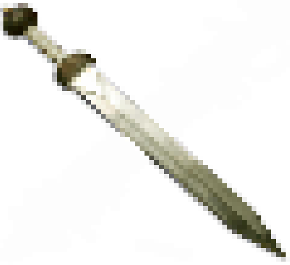

A modern MU* engine with [AberMUD](http://ftp.linux.org.uk/pub/linux/alan/Software/Games/AberMUD5/SOURCE/) universe.

Based on dumserver by Bartek Radwanski and Mark Frimston https://github.com/wowpin/dumserver

You can also use a mud client of your choice if you wish - use connection details below:

```
telnet [hostname] 35123
```

## Running the Server
```diff
- IMPORTANT - Python >= 3.6.7 is required (Ubuntu >= 18.04 LTS)!
```
1. Update your system `sudo apt update && sudo apt upgrade`
2. Get the repo `git clone https://code.freedombone.net/bashrc/AberMUSH`
3. CD into 'AberMUSH' and install the server `sudo ./installer.sh`
4. Run it by typing `python3 abermush.py`

You now should be able to connect to your server on `<server IP/hostname>:35123`



## Player Commands

All players can use the following commands:

``` bash
bio [description]                       - Set a description of yourself
change password [newpassword]           - Change your password
who                                     - List players and where they are
quit/exit                               - Leave the game
eat/drink [item]                        - Eat or drink a consumable
say [message]                           - Says something out loud
look/examine                            - Examines the surroundings
go [exit]                               - Moves through the exit specified
attack [target]                         - Attack another player or NPC
check inventory                         - Check the contents of your inventory
take/get [item]                         - Pick up an item
put [item] in/on [item]                 - Put an item into or onto another one
drop [item]                             - Drop an item
whisper [target] [message]              - Whisper to a player in the same room
tell/ask [target] [message]             - Send a tell message to another player or NPC
use/hold/pick/wield [item] [left|right] - Transfer an item to your hands
stow                                    - Free your hands of items
wear [item]                             - Wear an item
remove/unwear [item]                    - Remove a worn item
open [item]                             - Open an item or door
close [item]                            - Close an item or door
```


## Witch Commands

Witches are the admins of the system, and have additional supernatural powers. The first user to create an account gains witch status. Additional witches may be assigned by appending them to the `witches` file, which is located in the same directory as `abermush.py` is run from.

``` bash
close registrations              - Closes registrations of new players
open registrations               - Allows registrations of new players
mute/silence [target]            - Mutes a player and prevents them from attacking
unmute/unsilence [target]        - Unmutes a player
freeze [target]                  - Prevents a player from moving or attacking
unfreeze [target]                - Allows a player to move or attack
teleport [room]                  - Teleport to a room
summon [target]                  - Summons a player to your location
```

### NPC Types

NPCs defined within `def/npcs.json` have a few different modes. The rooms which they can occupy are defined within the `path` list and the ways in which they move is defined by the `moveType` parameter. Movement types are:

 * *cyclic* - Move from the start to the end of the list of rooms
 * *inverse cyclic* - Move from the end to the start of the list of rooms
 * *random* - Move to random rooms in the list
 * *patrol* - Move from the start to the end of the list, then back again
 * *follow* - Look for players and follow them around

If no `moveType` is specified then random movement is the default.

The speed at which NPCs move between rooms is defined by `moveDelay` and `randomFactor` parameters. RandomFactor just makes the delay between movements not completely predictable.


### NPC Conversations

You can create simple kinds of conversations with NPCs by editing `npcs.json` and adding line entries within the `conv` parameter. For example:

``` bash
"conv" : [
    [["serve","beer","?"], "Yes, of course"],
    [["serve","wine","?"], "We only serve the more disreputable wine"],
    [["have","order","like","beer","ale","drink","please"],"Here you go","give","114"],
    [["have","order","buy","purchase","trade","like","weapon","dagger","knife","please"],"This weapon may come in handy on your adventures","buy","624","1367"]
],
```

You can then tell the NPC something like:

``` bash
tell inn-keeper Do you serve wine?
```

The system will then try to match words within your `tell` command and pick the most appropriate reply:

``` bash
the old inn-keeper says: We only serve the more disreputable wine.
```

The NPC can also give an item if some words are matched, or exchange/buy/barter an item such as a gold coin for a small dagger. The numbers refer to item numbers within `items.json`.

### Adding Doors and Opening things

To add a door, or other object to be opened or closed you will need a pair of items, like the following:

``` bash
    "429": {
        "name": "old trapdoor",
        ...
        "state": "closed",
        "exitName": "up|down",
        "linkedItem": 430,
        "lockedWithItem": 0,
        "exit": "$rid=433$"
    },
    "430": {
        "name": "old trapdoor",
        ...
        "state": "closed",
        "exitName": "down|up",
        "linkedItem": 429,
        "lockedWithItem": 0,
        "exit": "$rid=431$"
    },
```

These are the same trapdoor as seen from two rooms. The `linkedItem` parameter links the two and the `exit` parameter defines which room to go to when going through. Exits called `down` and `up` are added if the trapdoor is open.

You should make some vague suggestion that these items can be opened within their `long_description` parameter.

If you need a key to open the door then specify the item number within the `lockedWithItem` parameter.


### Containers, Chests and Tables

Other than opening and closing doors you may also want to have items which can be opened or closed, and have things removed or put into them. For example a treasure chest containing gold coins. To define an item as openable the relevant attributes are similar to the following:

``` bash
    "207": {
        "name": "clothes chest",
        ...
        "state": "container closed",
        "open_description": "Tiny moths flutter out as you open the clothes chest.",
        "close_description": "The clothes chest closes with a satisfying thud.",
        "contains": ["107","1386","1389","1390"],
        "lockedWithItem": 0,
    },
```

The state of the item can be `container open` or `container closed`. You can then use commands such as:

``` bash
open chest
examine chest
take hat from chest
wear hat
close chest
```

Similar to doors, items may be locked with another item which could be a key. Tables can be a special type of always open item.

``` bash
    "1289": {
        "name": "inn table",
        ...
        "state": "container open always",
    },
```

You can then use a command such as:

``` bash
put hat on table
```
